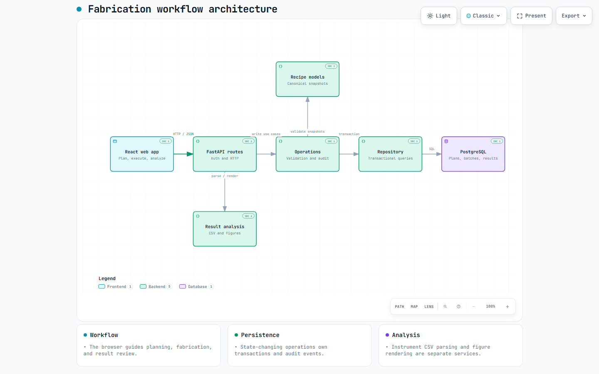

# Perovskite Solar Cell Fabrication Workflow

A laboratory workflow for planning perovskite solar-cell experiments, recording fabrication, and reviewing J-V characterization results. The current application is a system of record; automatic experiment suggestion remains future work.

## Workflow

1. An instructor creates a Campaign and an administrator registers the available device layouts. Materials, layer presets, and versioned Baselines help build complete recipes; a Baseline is optional.
2. A user creates a comparative plan (control and targets) or a standalone plan. Each condition stores its own recipe and layout snapshot. The plan is reviewed and released before fabrication.
3. A Fabrication Batch freezes the released conditions and tracks substrates, devices, solution preparations, process executions, and deviations.
4. A user uploads an instrument J-V CSV for a batch, assigns every parsed substrate to a condition, reviews directional statistics, and records any device exclusions with reasons. The source file and all scans remain preserved.

## Architecture

The React application calls FastAPI routes. State-changing operations validate and audit changes, while the repository persists snapshots and results in PostgreSQL. J-V parsing and publication figures are separate analysis services. [Download the interactive Archify diagram](docs/architecture/system-architecture.html) and open it locally, or read the [architecture guide](ARCHITECTURE.md).

## Getting started

The application requires Python 3.14 and PostgreSQL 18. Frontend development uses Node.js 24 and pnpm 11. On Windows, follow [local development](LOCAL_DEVELOPMENT_WINDOWS.md) to configure separate application and disposable test databases, apply migrations, create the first administrator, and start FastAPI. For access from other computers, follow the HTTPS and backup guidance in [deployment](DEPLOYMENT.md).

After the local setup, open `http://localhost:8000/login`. The React application is served at `/app/` after login. For frontend development, the local guide also covers running Vite beside FastAPI.

## Tests

The project uses Python unit and PostgreSQL integration tests, plus frontend Vitest, lint, type checking, and a production build. The [local development guide](LOCAL_DEVELOPMENT_WINDOWS.md#common-commands) gives the Windows test commands. Public pull requests run Ubuntu and Windows CI before merge.

## Documentation

| Topic | Guide |
| --- | --- |
| System modules, data ownership, and lifecycle | [Architecture](ARCHITECTURE.md) |
| Assignments, metric provenance, exclusions, and figures | [Result analysis](docs/result-analysis.md) |
| Experiment planning and fabrication steps | [Experiment workflow](docs/experiment-workflow-guide.md) |
| Ordered vacuum/gas program entry | [VCD program entry](docs/vcd-program-entry-guide.md) |
| Local Windows setup | [Local development](LOCAL_DEVELOPMENT_WINDOWS.md) |
| Production setup and safety | [Deployment](DEPLOYMENT.md) |

Repository files use en-US English for documentation, user-facing text, comments, scripts, and tests. Scientific terms, formulas, identifiers, and units retain their standard forms. Discussions may use English or Chinese.

## License

[MIT](LICENSE).
